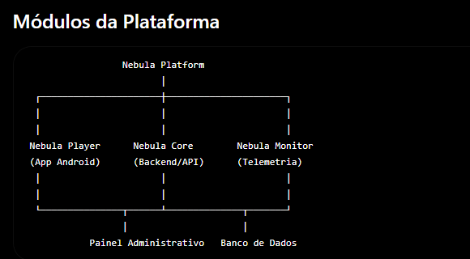

# Documento

**Projeto:** Nebula Platform

**Módulo:** Nebula Plataforma

**Versão:** 0.1.0

**Status:** Em desenvolvimento

**Última atualização:** 01/07/2026

**Responsável:** Felipe Almeida

---

O que é a Nebula Platform

A Nebula Platform é uma plataforma modular para gerenciamento operacional de dispositivos de streaming.

Ela é composta por diversos serviços independentes que trabalham em conjunto para oferecer ativação de dispositivos, gerenciamento de conteúdo, monitoramento operacional e reprodução de mídia.



# Arquitetura da Plataforma

A Nebula Platform é composta por módulos independentes, cada um com responsabilidades bem definidas. Essa separação reduz o acoplamento entre os componentes, facilita a manutenção e permite que cada módulo evolua de forma independente.

---

# 1. Nebula Player

O **Nebula Player** é responsável exclusivamente pela experiência do usuário.

## Responsabilidades

- Reprodução de conteúdo autorizado
- Interface gráfica (UI)
- Login e ativação do dispositivo
- Troca de canais
- Gerenciamento de favoritos
- Configurações do aplicativo
- Comunicação com o Nebula Core através das APIs

## Observações

O Nebula Player **não decide** qual recurso de conteúdo será utilizado.

Sua única responsabilidade é solicitar as informações ao **Nebula Core** e apresentar o conteúdo ao usuário. Não armazena o conteudo. 

---

# 2. Nebula Core

O **Nebula Core** é o núcleo da plataforma e concentra todas as regras de negócio.

## Responsabilidades

- Ativação de dispositivos
- Autenticação
- Gerenciamento de dispositivos
- Gerenciamento de recursos de conteúdo
- Gerenciamento dos servidores de conteúdo
- Distribuição dos ContentEndpoints autorizados
- Disponibilização das APIs
- Aplicação das regras de negócio

## Observações

Todos os demais módulos da plataforma dependem do Nebula Core para acesso às informações e tomada de decisão.

---

# 3. Nebula Monitor

O **Nebula Monitor** é responsável pelo monitoramento operacional da plataforma.

Seu objetivo é coletar métricas, identificar problemas e fornecer informações em tempo real sobre a qualidade do serviço.

## Responsabilidades

- Heartbeat dos dispositivos
- Monitoramento de Ping
- Tempo de Loading
- Buffering
- Uptime
- Disponibilidade dos servidores
- Registro de erros
- Métricas de QoS (Quality of Service)
- Estatísticas operacionais
- Dashboards
- Alertas

## Observações

O Nebula Monitor **não reproduz conteúdo**.

Sua função é exclusivamente observar, registrar e analisar o comportamento da plataforma.

---

# 4. Nebula Admin

O **Nebula Admin** é o serviço e a interface utilizados pelos administradores para gerenciamento e monitoramento.

## Arquitetura

```
Flutter Admin (UI)  →  Nebula Admin (FastAPI / BFF)  →  Nebula Core
```

- **Nebula Admin** é um **serviço BFF** (Backend for Frontend): autentica
  administradores (Admin JWT), aplica RBAC, compõe/adapta respostas do Core e
  **nunca acessa diretamente o PostgreSQL** (só o Core toca o banco).
- A comunicação Admin → Core é **service-to-service** e centralizada em um
  `NebulaCoreGateway`.
- O **Flutter Admin** é a interface gráfica (desacoplada; em produção servida
  via Nginx, fazendo proxy para o Nebula Admin).

## Responsabilidades

- Autenticação e autorização de administradores
- RBAC e tokens administrativos
- Cadastro de clientes
- Cadastro de ContentEndpoints / Playlists
- Cadastro de servidores
- Ativação, bloqueio e revogação de dispositivos
- Visualização de métricas e dashboards
- Geração de relatórios
- Auditoria administrativa

## Observações

O acesso é restrito a administradores. O Nebula Admin não possui regras de
domínio nem persistência de entidades do Core (a regra de negócio e o banco
pertencem ao Nebula Core).

---

# 5. Banco de Dados

O Banco de Dados centraliza todas as informações persistentes da plataforma.

## Principais Entidades

- Usuários
- Dispositivos
- ContentEndpoints
- Servidores
- Telemetria
- Logs
- Configurações

## Observações

Todo acesso ao banco deve ocorrer através do Nebula Core.

Nenhum outro módulo deve acessar diretamente os dados persistidos.

---

# Arquitetura Geral

```text
                 Nebula Platform
                        │
 ┌──────────────────────┼──────────────────────┐
 │                      │                      │
 │                      │                      │
Nebula Player      Nebula Core        Nebula Monitor
(App Android)      (Backend/API)      (Telemetria)
 │                      │                      │
 │                      │                      │
 └───────────────┬──────┴──────────────┬───────┘
                 │                     │
           Painel Administrativo   Banco de Dados
```
